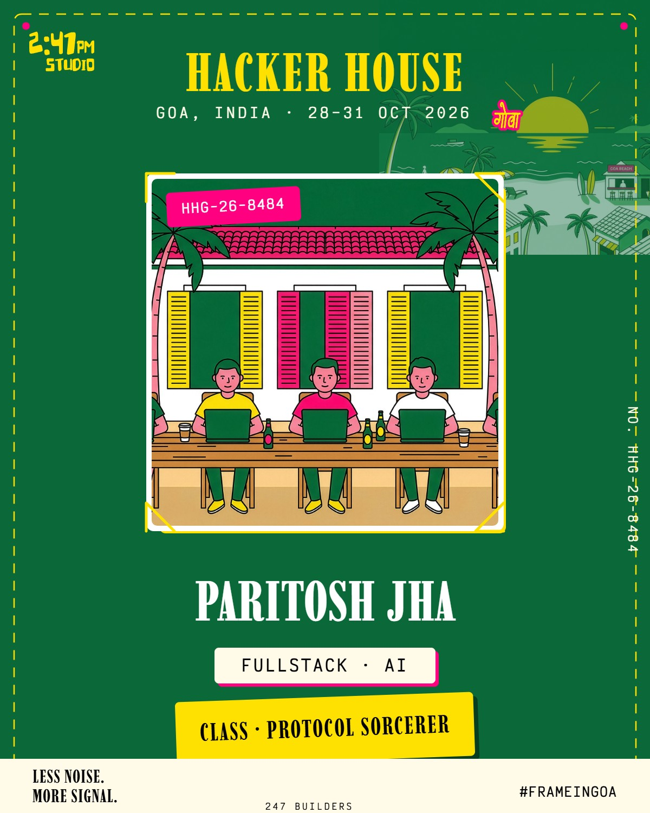

# 🏝️ HH Goa 2026 · Builder ID Generator

**Task #1 — HH Goa Frame / ID Card Generator** (hhgoa.com shortlisting task)

A web tool that turns an uploaded photo into a branded **HH Goa 2026 graphic** in seconds — ready to download and share on X with `#FrameInGoa`.

Built to be *unmistakably* HH Goa: same colors, same fonts, same brutalist-tropical attitude as [hhgoa.com](https://hhgoa.com). No login. No signup. One pass, start to finish.



## ✨ Features

| | |
|---|---|
| **Format A — PFP Frame** | 1080×1080 frame wrapping your photo into a ready-to-use X profile picture |
| **Format B — Builder ID Card** | 1200×1500 event badge: photo + name + stack + auto-generated **builder class** (e.g. *PROTOCOL SORCERER* 🧙) |
| **Real uploads** | JPG, PNG, **HEIC** (iPhone, decoded in-browser), WEBP — any aspect ratio, off-center crops handled by smart cover-crop |
| **Near-instant** | Renders live as you type — no loading screens |
| **Real download** | Actual PNG file, not a screen-only render |
| **Share to X** | Pre-filled caption with `#FrameInGoa`; shares the image via the native share sheet (Web Share API) or opens a pre-filled tweet |
| **Mobile-first** | Works in one thumb on a phone |

## 🚀 Run it

```bash
node serve.js
# → http://localhost:3000
```

Or serve the folder statically anywhere (GitHub Pages, Vercel, Netlify, Cloudflare Pages — no build step).

> **Deploy note:** for the link-share preview to show the generated graphic, set the `og:image` meta tag to an absolute URL of `assets/og-preview.jpg` on your deployed domain (relative URLs work locally; X's crawler needs an absolute one).

## 🧱 Structure

```
index.html      app shell + meta/OG tags
styles.css      full HH Goa brand system (tokens, marquee, brutalist shadows, glow CTA)
app.js          canvas renderers (ID card + PFP), HEIC decode, cover-crop, share/download
serve.js        tiny static server
assets/         brand assets (गोवा wordmark, 2:47 mark, sun, fonts-adjacent art, og-preview)
fonts/          self-hosted Imbue + Victor Mono (exact webfonts from hhgoa.com)
BRAND-ANALYSIS.md   the hhgoa.com design deep-dive this build is based on
```

## 🎨 Brand DNA (from hhgoa.com)

Deep green `#0b6839` · high-vis yellow `#fee101` · hot pink `#ff0080` · cream `#fffbe8` · Imbue display serif + Victor Mono · hard offset shadows · marquee tickers · Devanagari **गोवा** wordmark · "LESS NOISE. MORE SIGNAL."

---
*Made for HH Goa 2026 · #FrameInGoa*
